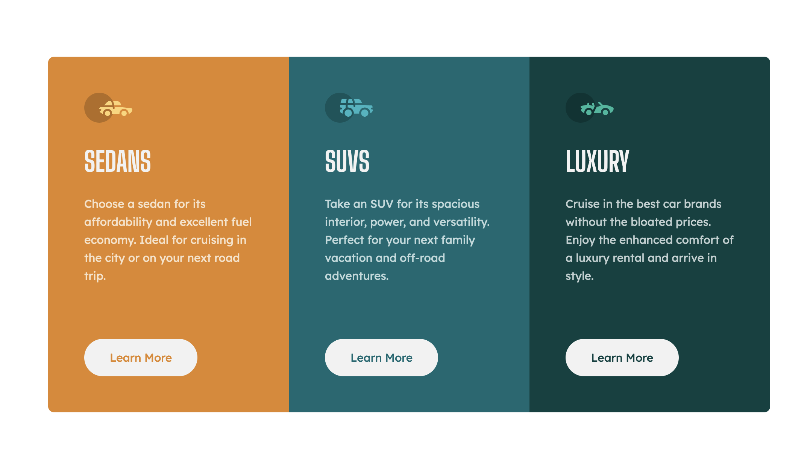

# Frontend Mentor - 3-column preview card component solution

This is a solution to the [3-column preview card component challenge on Frontend Mentor](https://www.frontendmentor.io/challenges/3column-preview-card-component-pH92eAR2-). Frontend Mentor challenges help you improve your coding skills by building realistic projects.

## Table of contents

- [Frontend Mentor - 3-column preview card component solution](#frontend-mentor---3-column-preview-card-component-solution)
  - [Table of contents](#table-of-contents)
  - [Overview](#overview)
    - [The challenge](#the-challenge)
    - [Screenshot](#screenshot)
    - [Links](#links)
  - [My process](#my-process)
    - [Built with](#built-with)
  - [Author](#author)

## Overview

### The challenge

Users should be able to:

- View the optimal layout depending on their device's screen size
- See hover states for interactive elements

### Screenshot

### Links

- Solution URL: [https://github.com/tatasadi/3-column-preview-card-component](https://github.com/tatasadi/3-column-preview-card-component)
- Live Site URL: [https://3-column-preview-card-component-ta.vercel.app](https://3-column-preview-card-component-ta.vercel.app)

## My process

### Built with

- [React](https://reactjs.org/) - JS library
- [Tailwind](https://tailwindcss.com/) - For styles

## Author

- Website - [Ehsan Tatasadi](https://ehsan.tatasadi.com)
- Linkedin - [Ehsan Tatasadi](https://www.linkedin.com/in/ehsan-tatasadi-2161a433)
- Twitter - [@etatasadi](https://twitter.com/etatasadi)
